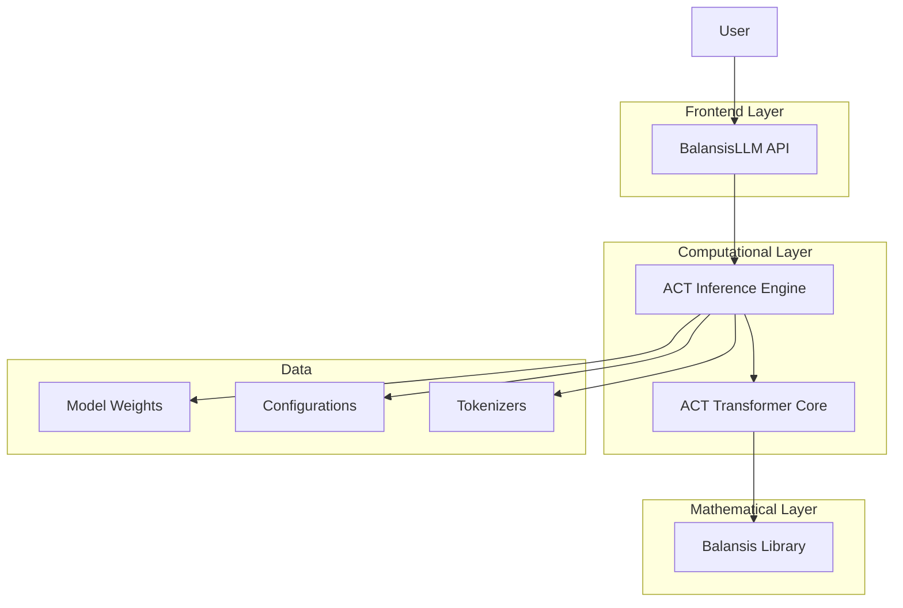
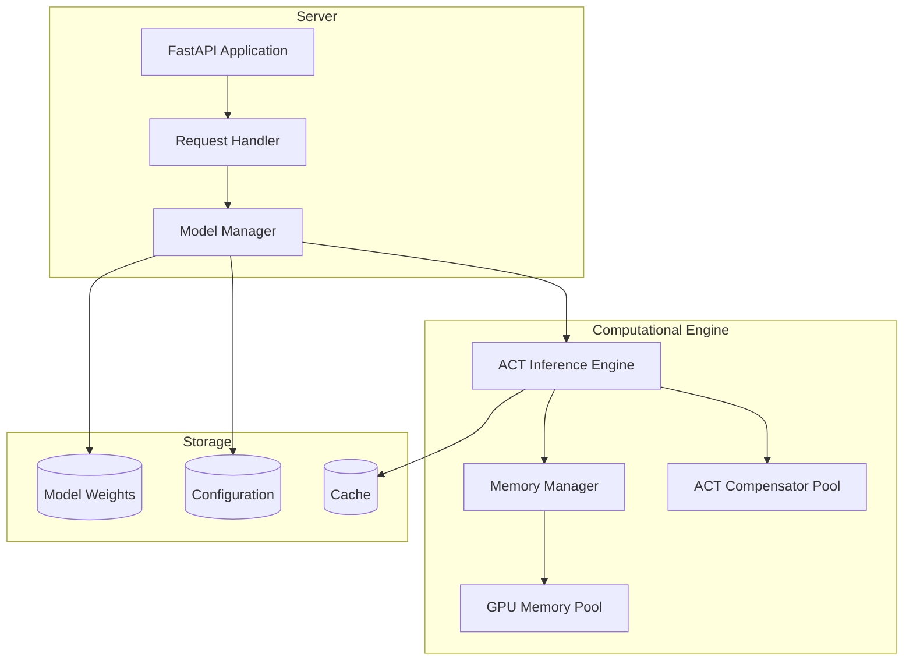
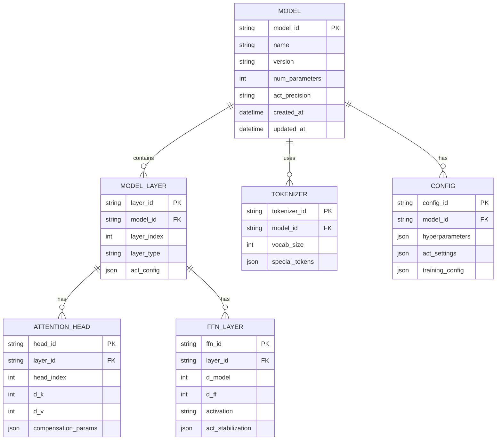

# BalansisLLM: Technical Architecture

## 1. Architectural Design



## 2. Technology Description

**Core Components:**
- Frontend: FastAPI + Pydantic for REST API
- Backend: PyTorch 2.0+ with CUDA support
- ACT Engine: Balansis library for numerical stability
- Storage: HuggingFace Hub for models, Redis for caching
- Monitoring: Prometheus + Grafana for metrics

**Dependencies:**
- balansis>=1.0.0
- torch>=2.0.0
- transformers>=4.30.0
- fastapi>=0.100.0
- pydantic>=2.0.0
- numpy>=1.24.0
- accelerate>=0.20.0
- deepspeed>=0.9.0

## 3. Route Definitions

| Route | Purpose |
|-------|----------|
| /health | Service health check |
| /models | List available models |
| /generate | Text generation |
| /chat | Chat with model |
| /embeddings | Get embeddings |
| /fine-tune | Model fine-tuning |
| /metrics | Performance metrics |

## 4. API Definitions

### 4.1 Core APIs

**Text Generation**
```
POST /api/v1/generate
```

Request:
| Parameter | Type | Required | Description |
|-----------|------|----------|-------------|
| prompt | string | true | Input text for generation |
| max_length | integer | false | Maximum generation length (default: 100) |
| temperature | float | false | Sampling temperature (default: 1.0) |
| top_p | float | false | Nucleus sampling parameter (default: 0.9) |
| act_precision | string | false | ACT precision level: "standard", "high", "ultra" |

Response:
| Parameter | Type | Description |
|-----------|------|-------------|
| generated_text | string | Generated text |
| tokens_generated | integer | Number of generated tokens |
| inference_time | float | Inference time in seconds |
| act_stability_score | float | ACT numerical stability score |

Request example:
```json
{
  "prompt": "Artificial intelligence is",
  "max_length": 150,
  "temperature": 0.8,
  "act_precision": "high"
}
```

Response example:
```json
{
  "generated_text": "Artificial intelligence is a field of computer science that deals with creating systems capable of performing tasks that typically require human intelligence...",
  "tokens_generated": 45,
  "inference_time": 0.234,
  "act_stability_score": 0.998
}
```

**Chat with Model**
```
POST /api/v1/chat
```

Request:
| Parameter | Type | Required | Description |
|-----------|------|----------|-------------|
| messages | array | true | Chat message history |
| model | string | false | Model identifier |
| stream | boolean | false | Streaming generation |

**Get Embeddings**
```
POST /api/v1/embeddings
```

Request:
| Parameter | Type | Required | Description |
|-----------|------|----------|-------------|
| input | string/array | true | Text for embedding generation |
| model | string | false | Embedding model |
| act_normalization | boolean | false | ACT embedding normalization |

## 5. Server Architecture



## 6. Data Model

### 6.1 Data Model Definition



### 6.2 Data Definition Language (DDL)

**Models table (models)**
```sql
-- Creating models table
CREATE TABLE models (
    model_id UUID PRIMARY KEY DEFAULT gen_random_uuid(),
    name VARCHAR(255) NOT NULL,
    version VARCHAR(50) NOT NULL,
    num_parameters BIGINT NOT NULL,
    act_precision VARCHAR(20) DEFAULT 'standard' CHECK (act_precision IN ('standard', 'high', 'ultra')),
    model_path TEXT NOT NULL,
    config_path TEXT NOT NULL,
    is_active BOOLEAN DEFAULT true,
    created_at TIMESTAMP WITH TIME ZONE DEFAULT NOW(),
    updated_at TIMESTAMP WITH TIME ZONE DEFAULT NOW()
);

-- Creating indexes
CREATE INDEX idx_models_name ON models(name);
CREATE INDEX idx_models_active ON models(is_active);
CREATE INDEX idx_models_created_at ON models(created_at DESC);

-- Data initialization
INSERT INTO models (name, version, num_parameters, act_precision, model_path, config_path)
VALUES 
    ('balansis-llm-small', '1.0.0', 125000000, 'standard', '/models/small/pytorch_model.bin', '/models/small/config.json'),
    ('balansis-llm-base', '1.0.0', 350000000, 'high', '/models/base/pytorch_model.bin', '/models/base/config.json'),
    ('balansis-llm-large', '1.0.0', 7000000000, 'ultra', '/models/large/pytorch_model.bin', '/models/large/config.json');
```

**Inference sessions table (inference_sessions)**
```sql
-- Creating sessions table
CREATE TABLE inference_sessions (
    session_id UUID PRIMARY KEY DEFAULT gen_random_uuid(),
    model_id UUID REFERENCES models(model_id),
    user_id VARCHAR(255),
    prompt TEXT NOT NULL,
    generated_text TEXT,
    tokens_input INTEGER,
    tokens_output INTEGER,
    inference_time_ms INTEGER,
    act_stability_score DECIMAL(5,4),
    temperature DECIMAL(3,2) DEFAULT 1.0,
    top_p DECIMAL(3,2) DEFAULT 0.9,
    created_at TIMESTAMP WITH TIME ZONE DEFAULT NOW()
);

-- Creating indexes
CREATE INDEX idx_inference_sessions_model_id ON inference_sessions(model_id);
CREATE INDEX idx_inference_sessions_user_id ON inference_sessions(user_id);
CREATE INDEX idx_inference_sessions_created_at ON inference_sessions(created_at DESC);
CREATE INDEX idx_inference_sessions_stability_score ON inference_sessions(act_stability_score DESC);
```

**Performance metrics table (performance_metrics)**
```sql
-- Creating metrics table
CREATE TABLE performance_metrics (
    metric_id UUID PRIMARY KEY DEFAULT gen_random_uuid(),
    model_id UUID REFERENCES models(model_id),
    metric_name VARCHAR(100) NOT NULL,
    metric_value DECIMAL(10,6) NOT NULL,
    measurement_time TIMESTAMP WITH TIME ZONE DEFAULT NOW(),
    metadata JSONB
);

-- Creating indexes
CREATE INDEX idx_performance_metrics_model_id ON performance_metrics(model_id);
CREATE INDEX idx_performance_metrics_name ON performance_metrics(metric_name);
CREATE INDEX idx_performance_metrics_time ON performance_metrics(measurement_time DESC);

-- Initializing basic metrics
INSERT INTO performance_metrics (model_id, metric_name, metric_value, metadata)
SELECT 
    m.model_id,
    'act_compensation_efficiency',
    0.995,
    '"description": "ACT compensation efficiency", "unit": "ratio"}'
FROM models m;
```

**ACT configurations table (act_configurations)**
```sql
-- Creating ACT configurations table
CREATE TABLE act_configurations (
    config_id UUID PRIMARY KEY DEFAULT gen_random_uuid(),
    model_id UUID REFERENCES models(model_id),
    compensator_precision VARCHAR(20) NOT NULL,
    absolute_epsilon DECIMAL(15,12) DEFAULT 1e-8,
    eternity_threshold DECIMAL(15,6) DEFAULT 1e6,
    gradient_compensation BOOLEAN DEFAULT true,
    attention_stabilization BOOLEAN DEFAULT true,
    layer_norm_compensation BOOLEAN DEFAULT true,
    weight_stabilization BOOLEAN DEFAULT true,
    created_at TIMESTAMP WITH TIME ZONE DEFAULT NOW()
);

-- Creating indexes
CREATE INDEX idx_act_configurations_model_id ON act_configurations(model_id);
CREATE INDEX idx_act_configurations_precision ON act_configurations(compensator_precision);

-- Initializing ACT configurations
INSERT INTO act_configurations (model_id, compensator_precision, absolute_epsilon, eternity_threshold)
SELECT 
    model_id,
    act_precision,
    CASE 
        WHEN act_precision = 'standard' THEN 1e-6
        WHEN act_precision = 'high' THEN 1e-8
        WHEN act_precision = 'ultra' THEN 1e-12
    END,
    CASE 
        WHEN act_precision = 'standard' THEN 1e4
        WHEN act_precision = 'high' THEN 1e6
        WHEN act_precision = 'ultra' THEN 1e8
    END
FROM models;
```

## 7. TypeScript Data Types

```typescript
// Basic types for API
export interface GenerateRequest {
  prompt: string;
  max_length?: number;
  temperature?: number;
  top_p?: number;
  act_precision?: 'standard' | 'high' | 'ultra';
}

export interface GenerateResponse {
  generated_text: string;
  tokens_generated: number;
  inference_time: number;
  act_stability_score: number;
}

export interface ChatMessage {
  role: 'user' | 'assistant' | 'system';
  content: string;
  timestamp?: string;
}

export interface ChatRequest {
  messages: ChatMessage[];
  model?: string;
  stream?: boolean;
  act_config?: ACTConfig;
}

export interface ACTConfig {
  compensator_precision: 'standard' | 'high' | 'ultra';
  absolute_epsilon: number;
  eternity_threshold: number;
  gradient_compensation: boolean;
  attention_stabilization: boolean;
}

export interface ModelInfo {
  model_id: string;
  name: string;
  version: string;
  num_parameters: number;
  act_precision: string;
  is_active: boolean;
  created_at: string;
}

export interface PerformanceMetrics {
  model_id: string;
  throughput_tokens_per_second: number;
  latency_ms: number;
  memory_usage_gb: number;
  act_stability_score: number;
  gpu_utilization: number;
}
```

## 8. Deployment and Scaling

### 8.1 Docker Compose Configuration

```yaml
version: '3.8'

services:
  balansis-llm-api:
    build: .
    ports:
      - "8000:8000"
    environment:
      - CUDA_VISIBLE_DEVICES=0,1,2,3
      - MODEL_PATH=/models
      - ACT_PRECISION=high
    volumes:
      - ./models:/models
      - ./logs:/app/logs
    depends_on:
      - redis
      - postgres
    deploy:
      resources:
        reservations:
          devices:
            - driver: nvidia
              count: 4
              capabilities: [gpu]

  redis:
    image: redis:7-alpine
    ports:
      - "6379:6379"
    volumes:
      - redis_data:/data

  postgres:
    image: postgres:15
    environment:
      - POSTGRES_DB=balansis_llm
      - POSTGRES_USER=balansis
      - POSTGRES_PASSWORD=secure_password
    volumes:
      - postgres_data:/var/lib/postgresql/data
    ports:
      - "5432:5432"

  prometheus:
    image: prom/prometheus
    ports:
      - "9090:9090"
    volumes:
      - ./monitoring/prometheus.yml:/etc/prometheus/prometheus.yml

  grafana:
    image: grafana/grafana
    ports:
      - "3000:3000"
    environment:
      - GF_SECURITY_ADMIN_PASSWORD=admin
    volumes:
      - grafana_data:/var/lib/grafana

volumes:
  redis_data:
  postgres_data:
  grafana_data:
```

### 8.2 Kubernetes Deployment

```yaml
apiVersion: apps/v1
kind: Deployment
metadata:
  name: balansis-llm-deployment
spec:
  replicas: 3
  selector:
    matchLabels:
      app: balansis-llm
  template:
    metadata:
      labels:
        app: balansis-llm
    spec:
      containers:
      - name: balansis-llm
        image: balansis-llm:latest
        ports:
        - containerPort: 8000
        resources:
          requests:
            nvidia.com/gpu: 1
            memory: "16Gi"
            cpu: "4"
          limits:
            nvidia.com/gpu: 1
            memory: "32Gi"
            cpu: "8"
        env:
        - name: MODEL_PATH
          value: "/models"
        - name: ACT_PRECISION
          value: "high"
        volumeMounts:
        - name: model-storage
          mountPath: /models
      volumes:
      - name: model-storage
        persistentVolumeClaim:
          claimName: model-pvc
---
apiVersion: v1
kind: Service
metadata:
  name: balansis-llm-service
spec:
  selector:
    app: balansis-llm
  ports:
  - port: 80
    targetPort: 8000
  type: LoadBalancer
```

## 9. Monitoring and Logging

### 9.1 Prometheus Metrics

```python
# Metrics definition
from prometheus_client import Counter, Histogram, Gauge

# Request counters
request_count = Counter(
    'balansis_llm_requests_total',
    'Total number of requests',
    ['method', 'endpoint', 'status']
)

# Processing time
request_duration = Histogram(
    'balansis_llm_request_duration_seconds',
    'Request duration in seconds',
    ['method', 'endpoint']
)

# ACT stability
act_stability = Gauge(
    'balansis_llm_act_stability_score',
    'ACT numerical stability score',
    ['model_id']
)

# GPU utilization
gpu_utilization = Gauge(
    'balansis_llm_gpu_utilization_percent',
    'GPU utilization percentage',
    ['gpu_id']
)

# Model memory
model_memory_usage = Gauge(
    'balansis_llm_model_memory_bytes',
    'Model memory usage in bytes',
    ['model_id']
)
```

### 9.2 Structured Logging

```python
import structlog
from structlog import get_logger

# Logging configuration
structlog.configure(
    processors=[
        structlog.stdlib.filter_by_level,
        structlog.stdlib.add_logger_name,
        structlog.stdlib.add_log_level,
        structlog.stdlib.PositionalArgumentsFormatter(),
        structlog.processors.TimeStamper(fmt="iso"),
        structlog.processors.StackInfoRenderer(),
        structlog.processors.format_exc_info,
        structlog.processors.UnicodeDecoder(),
        structlog.processors.JSONRenderer()
    ],
    context_class=dict,
    logger_factory=structlog.stdlib.LoggerFactory(),
    wrapper_class=structlog.stdlib.BoundLogger,
    cache_logger_on_first_use=True,
)

logger = get_logger()

# Usage example
logger.info(
    "Generation completed",
    model_id="balansis-llm-base",
    prompt_length=50,
    generated_tokens=120,
    inference_time=0.234,
    act_stability_score=0.998,
    gpu_memory_used="8.5GB"
)
```

## 10. Security and Performance

### 10.1 Authentication and Authorization

```python
from fastapi import Depends, HTTPException, status
from fastapi.security import HTTPBearer, HTTPAuthorizationCredentials
import jwt

security = HTTPBearer()

async def verify_token(credentials: HTTPAuthorizationCredentials = Depends(security)):
    try:
        payload = jwt.decode(
            credentials.credentials, 
            SECRET_KEY, 
            algorithms=["HS256"]
        )
        user_id = payload.get("sub")
        if user_id is None:
            raise HTTPException(
                status_code=status.HTTP_401_UNAUTHORIZED,
                detail="Invalid authentication credentials"
            )
        return user_id
    except jwt.PyJWTError:
        raise HTTPException(
            status_code=status.HTTP_401_UNAUTHORIZED,
            detail="Invalid authentication credentials"
        )
```

### 10.2 Rate Limiting

```python
from slowapi import Limiter, _rate_limit_exceeded_handler
from slowapi.util import get_remote_address
from slowapi.errors import RateLimitExceeded

limiter = Limiter(key_func=get_remote_address)
app.state.limiter = limiter
app.add_exception_handler(RateLimitExceeded, _rate_limit_exceeded_handler)

@app.post("/api/v1/generate")
@limiter.limit("10/minute")
async def generate_text(
    request: Request,
    generate_request: GenerateRequest,
    user_id: str = Depends(verify_token)
):
    # Generation logic
    pass
```

### 10.3 Caching

```python
import redis
from functools import wraps
import hashlib
import json

redis_client = redis.Redis(host='localhost', port=6379, db=0)

def cache_result(expiration=3600):
    def decorator(func):
        @wraps(func)
        async def wrapper(*args, **kwargs):
            # Creating cache key
            cache_key = hashlib.md5(
                json.dumps({
                    'func': func.__name__,
                    'args': str(args),
                    'kwargs': str(kwargs)
                }, sort_keys=True).encode()
            ).hexdigest()
            
            # Checking cache
            cached_result = redis_client.get(cache_key)
            if cached_result:
                return json.loads(cached_result)
            
            # Executing function
            result = await func(*args, **kwargs)
            
            # Saving to cache
            redis_client.setex(
                cache_key, 
                expiration, 
                json.dumps(result)
            )
            
            return result
        return wrapper
    return decorator
```

This technical architecture provides a complete implementation of BalansisLLM using modern development, monitoring, and deployment practices, demonstrating the practical application of the Balansis library in real production systems.