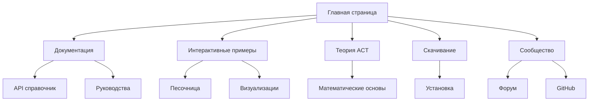

# Balansis Website - Требования к продукту

## 1. Обзор продукта

Современный веб-сайт для Balansis - революционной Python библиотеки, реализующей Теорию Абсолютной Компенсации (ACT). Сайт должен служить профессиональной витриной для математиков, исследователей и Python разработчиков, демонстрируя возможности стабильных математических вычислений.

Цель сайта - привлечь разработчиков к использованию библиотеки, предоставить полную документацию и создать сообщество вокруг инновационного подхода к численным вычислениям.

## 2. Основные функции

### 2.1 Пользовательские роли

| Роль | Метод регистрации | Основные права |
|------|-------------------|----------------|
| Посетитель | Без регистрации | Просмотр документации, примеров, скачивание |
| Разработчик | GitHub OAuth | Доступ к интерактивным примерам, форуму |
| Контрибьютор | Приглашение | Редактирование документации, модерация |

### 2.2 Модули функций

Веб-сайт Balansis состоит из следующих основных страниц:

1. **Главная страница**: героический раздел, навигация, обзор возможностей, призыв к действию
2. **Документация**: API справочник, руководства, примеры кода
3. **Интерактивные примеры**: живые демонстрации, песочница для кода
4. **Теория ACT**: математические основы, научные статьи
5. **Сообщество**: форум, GitHub интеграция, контрибьюторы
6. **Скачивание**: инструкции по установке, релизы

### 2.3 Детали страниц

| Название страницы | Название модуля | Описание функций |
|-------------------|-----------------|------------------|
| Главная страница | Героический раздел | Анимированная демонстрация математических операций, слоган "Стабильная математика без исключений" |
| Главная страница | Обзор возможностей | Карточки с ключевыми преимуществами: устранение деления на ноль, предотвращение переполнения, повышенная точность |
| Главная страница | Быстрый старт | Интерактивный код-блок с примером использования AbsoluteValue |
| Документация | API справочник | Автоматически генерируемая документация из docstrings, поиск по API |
| Документация | Руководства | Пошаговые туториалы для начинающих и продвинутых пользователей |
| Документация | Примеры кода | Коллекция практических примеров с объяснениями |
| Интерактивные примеры | Песочница | Встроенный Python интерпретер для тестирования кода |
| Интерактивные примеры | Визуализации | Интерактивные графики математических операций |
| Теория ACT | Математические основы | Подробное объяснение теории, формулы, доказательства |
| Теория ACT | Научные статьи | Публикации, исследования, ссылки на источники |
| Сообщество | Форум | Обсуждения, вопросы и ответы, поддержка пользователей |
| Сообщество | GitHub интеграция | Статистика репозитория, последние коммиты, issues |
| Скачивание | Установка | Инструкции для pip, poetry, conda |
| Скачивание | Релизы | История версий, changelog, миграционные руководства |

## 3. Основные процессы

**Процесс для посетителя:**
Пользователь попадает на главную страницу → изучает возможности библиотеки → переходит к документации или примерам → скачивает и устанавливает библиотеку → присоединяется к сообществу.

**Процесс для разработчика:**
Авторизация через GitHub → доступ к интерактивным примерам → тестирование кода в песочнице → изучение API → участие в форуме → контрибьюция в проект.

## 4. Дизайн пользовательского интерфейса

### 4.1 Стиль дизайна

- **Основные цвета**: Глубокий синий (#1e3a8a), Золотой акцент (#f59e0b), Белый (#ffffff)
- **Вторичные цвета**: Серый (#6b7280), Светло-синий (#3b82f6), Зеленый успеха (#10b981)
- **Стиль кнопок**: Современные с закругленными углами, градиентные эффекты, hover анимации
- **Шрифты**: Inter для заголовков (24px-48px), Source Code Pro для кода (14px-16px)
- **Стиль макета**: Карточный дизайн, фиксированная верхняя навигация, боковая панель для документации
- **Иконки**: Lucide icons, математические символы, анимированные SVG

### 4.2 Обзор дизайна страниц

| Название страницы | Название модуля | UI элементы |
|-------------------|-----------------|-------------|
| Главная страница | Героический раздел | Полноэкранный баннер с анимированными математическими формулами, градиентный фон, CTA кнопка |
| Главная страница | Обзор возможностей | Сетка 3x2 карточек с иконками, hover эффекты, цветовое кодирование |
| Документация | Навигация | Боковая панель с древовидной структурой, поиск, хлебные крошки |
| Документация | Контент | Двухколоночный макет, подсветка синтаксиса, копирование кода |
| Интерактивные примеры | Песочница | Разделенный экран: редактор кода слева, результат справа, темная тема |
| Теория ACT | Формулы | LaTeX рендеринг, интерактивные диаграммы, математические обозначения |

### 4.3 Адаптивность

Сайт разработан с подходом desktop-first с полной адаптацией под мобильные устройства. Включена оптимизация для сенсорного взаимодействия, мобильное меню-гамбургер, адаптивные сетки и типографика.