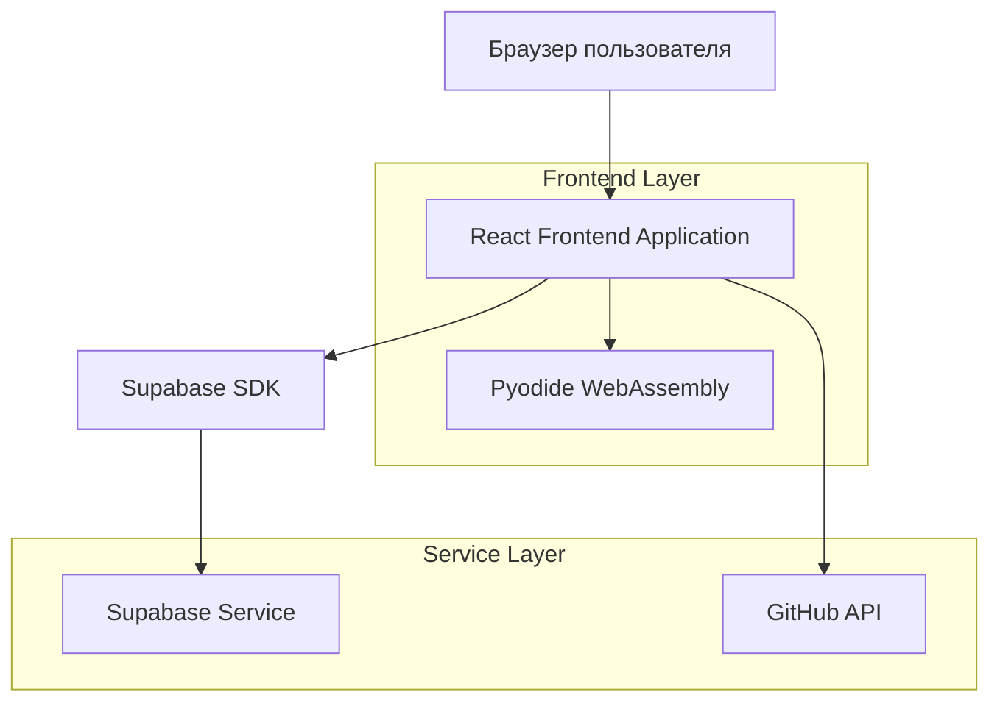
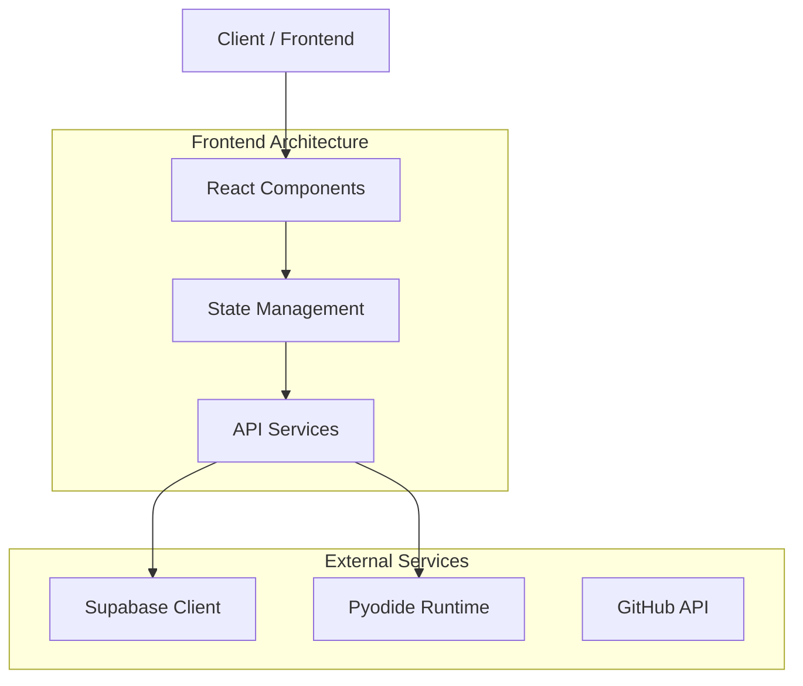
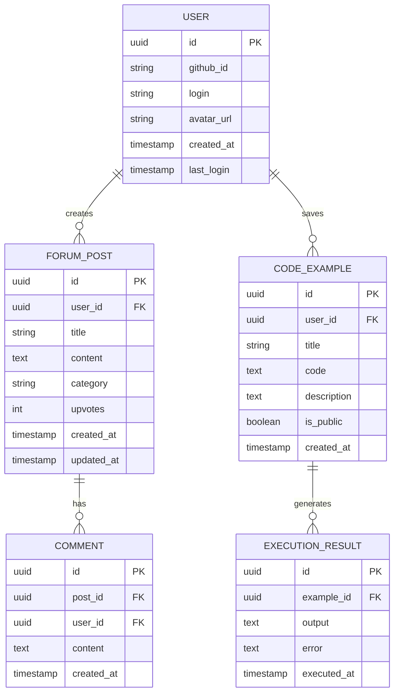

# Balansis Website - Техническая архитектура

## 1. Архитектурный дизайн



## 2. Описание технологий

- Frontend: React@18 + TypeScript + Tailwind CSS + Vite
- Backend: Supabase (аутентификация, база данных)
- Python Runtime: Pyodide (WebAssembly для интерактивных примеров)
- Интеграции: GitHub API, MathJax для LaTeX

## 3. Определения маршрутов

| Маршрут | Назначение |
|---------|------------|
| / | Главная страница с героическим разделом и обзором |
| /docs | Документация и API справочник |
| /docs/api | Автоматически генерируемый API справочник |
| /docs/guides | Руководства и туториалы |
| /examples | Интерактивные примеры и песочница |
| /theory | Теория ACT и математические основы |
| /community | Форум и GitHub интеграция |
| /download | Инструкции по установке и релизы |
| /login | Страница авторизации через GitHub |

## 4. API определения

### 4.1 Core API

Аутентификация пользователей
```
POST /auth/github
```

Запрос:
| Название параметра | Тип параметра | Обязательный | Описание |
|-------------------|---------------|--------------|----------|
| code | string | true | GitHub OAuth код |
| state | string | true | CSRF токен |

Ответ:
| Название параметра | Тип параметра | Описание |
|-------------------|---------------|----------|
| user | object | Данные пользователя |
| session | object | Сессия пользователя |

Пример:
```json
{
  "user": {
    "id": "github_123456",
    "login": "developer",
    "avatar_url": "https://github.com/avatar.jpg"
  },
  "session": {
    "access_token": "...",
    "expires_at": "2024-12-31T23:59:59Z"
  }
}
```

Выполнение Python кода
```
POST /api/execute
```

Запрос:
| Название параметра | Тип параметра | Обязательный | Описание |
|-------------------|---------------|--------------|----------|
| code | string | true | Python код для выполнения |
| context | string | false | Контекст выполнения |

Ответ:
| Название параметра | Тип параметра | Описание |
|-------------------|---------------|----------|
| result | string | Результат выполнения |
| error | string | Ошибка выполнения (если есть) |

## 5. Архитектурная диаграмма сервера



## 6. Модель данных

### 6.1 Определение модели данных



### 6.2 Язык определения данных

Таблица пользователей (users)
```sql
-- создание таблицы
CREATE TABLE users (
    id UUID PRIMARY KEY DEFAULT gen_random_uuid(),
    github_id VARCHAR(50) UNIQUE NOT NULL,
    login VARCHAR(100) NOT NULL,
    avatar_url TEXT,
    created_at TIMESTAMP WITH TIME ZONE DEFAULT NOW(),
    last_login TIMESTAMP WITH TIME ZONE DEFAULT NOW()
);

-- создание индексов
CREATE INDEX idx_users_github_id ON users(github_id);
CREATE INDEX idx_users_login ON users(login);

-- права доступа
GRANT SELECT ON users TO anon;
GRANT ALL PRIVILEGES ON users TO authenticated;
```

Таблица постов форума (forum_posts)
```sql
-- создание таблицы
CREATE TABLE forum_posts (
    id UUID PRIMARY KEY DEFAULT gen_random_uuid(),
    user_id UUID REFERENCES users(id),
    title VARCHAR(200) NOT NULL,
    content TEXT NOT NULL,
    category VARCHAR(50) DEFAULT 'general',
    upvotes INTEGER DEFAULT 0,
    created_at TIMESTAMP WITH TIME ZONE DEFAULT NOW(),
    updated_at TIMESTAMP WITH TIME ZONE DEFAULT NOW()
);

-- создание индексов
CREATE INDEX idx_forum_posts_user_id ON forum_posts(user_id);
CREATE INDEX idx_forum_posts_category ON forum_posts(category);
CREATE INDEX idx_forum_posts_created_at ON forum_posts(created_at DESC);

-- права доступа
GRANT SELECT ON forum_posts TO anon;
GRANT ALL PRIVILEGES ON forum_posts TO authenticated;
```

Таблица комментариев (comments)
```sql
-- создание таблицы
CREATE TABLE comments (
    id UUID PRIMARY KEY DEFAULT gen_random_uuid(),
    post_id UUID REFERENCES forum_posts(id) ON DELETE CASCADE,
    user_id UUID REFERENCES users(id),
    content TEXT NOT NULL,
    created_at TIMESTAMP WITH TIME ZONE DEFAULT NOW()
);

-- создание индексов
CREATE INDEX idx_comments_post_id ON comments(post_id);
CREATE INDEX idx_comments_user_id ON comments(user_id);

-- права доступа
GRANT SELECT ON comments TO anon;
GRANT ALL PRIVILEGES ON comments TO authenticated;
```

Таблица примеров кода (code_examples)
```sql
-- создание таблицы
CREATE TABLE code_examples (
    id UUID PRIMARY KEY DEFAULT gen_random_uuid(),
    user_id UUID REFERENCES users(id),
    title VARCHAR(200) NOT NULL,
    code TEXT NOT NULL,
    description TEXT,
    is_public BOOLEAN DEFAULT false,
    created_at TIMESTAMP WITH TIME ZONE DEFAULT NOW()
);

-- создание индексов
CREATE INDEX idx_code_examples_user_id ON code_examples(user_id);
CREATE INDEX idx_code_examples_public ON code_examples(is_public);

-- права доступа
GRANT SELECT ON code_examples TO anon;
GRANT ALL PRIVILEGES ON code_examples TO authenticated;

-- начальные данные
INSERT INTO code_examples (user_id, title, code, description, is_public) VALUES
(NULL, 'Базовый пример AbsoluteValue', 
'from balansis.core import AbsoluteValue

# Создание AbsoluteValue объектов
a = AbsoluteValue(magnitude=5.0, direction=1)
b = AbsoluteValue(magnitude=3.0, direction=-1)

# Безопасные арифметические операции
result = a + b
print(f"Результат: {result}")

# Создание специального значения Absolute
absolute = AbsoluteValue.absolute()
print(f"Absolute: {absolute}")',
'Демонстрация основных операций с AbsoluteValue', true);
```