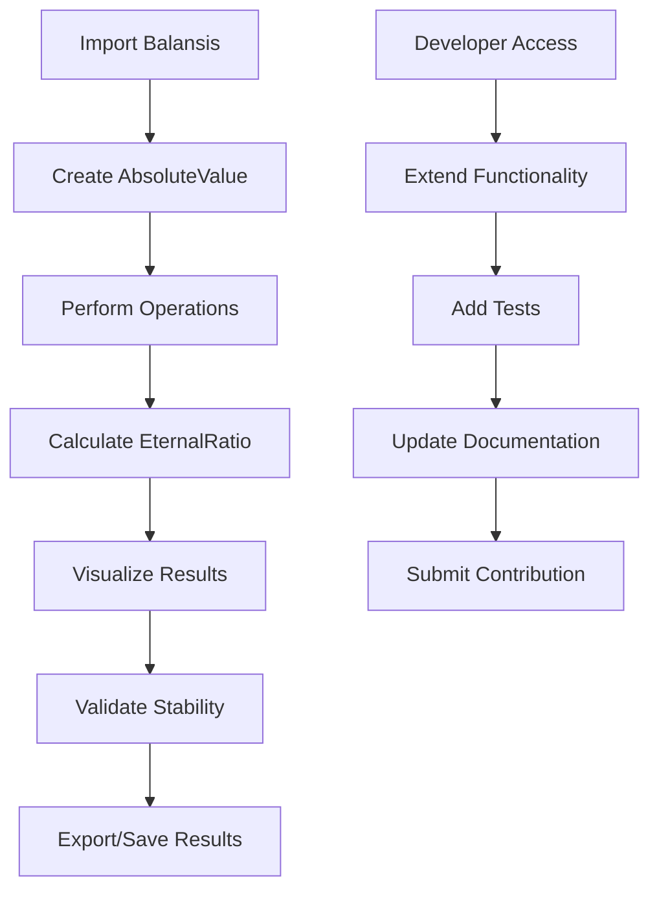

# Balansis: Product Requirements Document

## 1. Product Overview

**Balansis** is a Python mathematical library implementing Absolute Compensation Theory (ACT) - a novel framework replacing traditional zero and infinity with Absolute and Eternity concepts for enhanced computational stability.

The library addresses fundamental mathematical instabilities (division by zero, overflows) by introducing alternative number types and operations based on balance, structural symmetry, and stability principles. Target users include researchers, developers, and mathematicians working in AI, cryptography, distributed systems, physics, and finance who need stable mathematical operations without traditional zero/infinity limitations.

## 2. Core Features

### 2.1 User Roles

| Role | Registration Method | Core Permissions |
|------|---------------------|------------------|
| Library User | Python package installation | Can import and use all mathematical operations, create AbsoluteValue and EternalRatio objects |
| Developer/Contributor | GitHub repository access | Can extend library functionality, contribute to core modules, run test suites |
| Researcher | Documentation access | Can access theoretical foundations, examples, and advanced mathematical concepts |

### 2.2 Feature Module

Our mathematical library consists of the following main modules:

1. **Core Mathematical Types**: AbsoluteValue class with magnitude/direction properties, EternalRatio for structural ratios, fundamental ACT operations.
2. **Algebraic Structures**: Absolute group operations, eternity field mathematics, advanced algebraic manipulations.
3. **Compensation Logic**: Compensation engine for balance calculations, stability verification, structural invariant maintenance.
4. **Utilities and Visualization**: Plotting tools for mathematical concepts, helper functions, data conversion utilities.
5. **Examples and Documentation**: Jupyter notebooks with usage demos, comprehensive API documentation, theoretical explanations.

### 2.3 Page Details

| Module Name | Component Name | Feature Description |
|-------------|----------------|---------------------|
| Core Types | AbsoluteValue | Create values with magnitude and direction (+1/-1), perform compensated addition, inversion operations, convert to standard float |
| Core Types | EternalRatio | Calculate invariant ratios between AbsoluteValues, maintain structural stability, provide ratio value extraction |
| Core Types | Operations | Implement compensated arithmetic, comparison operations, mathematical transformations following ACT axioms |
| Algebraic Structures | AbsoluteGroup | Define group operations on Absolute values, ensure closure and associativity, implement group theory concepts |
| Algebraic Structures | EternityField | Create field structure for eternal ratios, support field operations, maintain mathematical consistency |
| Compensation Logic | Compensator | Balance calculation engine, stability verification algorithms, structural invariant checking |
| Utilities | Plotting | Visualize AbsoluteValue relationships, plot compensation patterns, create mathematical diagrams |
| Examples | Jupyter Notebooks | Interactive demos for each concept, step-by-step tutorials, practical application examples |

## 3. Core Process

**Primary User Flow - Mathematical Operations:**
1. User imports Balansis library components
2. Creates AbsoluteValue objects with magnitude and direction
3. Performs compensated operations (addition, inversion, comparison)
4. Calculates EternalRatios for structural analysis
5. Visualizes results using plotting utilities
6. Validates stability using compensation logic

**Developer Flow - Library Extension:**
1. Developer accesses source code and documentation
2. Implements new mathematical operations following ACT principles
3. Adds comprehensive tests with >95% coverage
4. Updates documentation and examples
5. Submits contributions through version control

## 4. User Interface Design

### 4.1 Design Style

- **Primary Colors**: Deep blue (#1e3a8a) for stability, gold (#f59e0b) for balance concepts
- **Secondary Colors**: Gray (#6b7280) for neutral elements, green (#10b981) for successful operations
- **Code Style**: Monospace fonts (Consolas, Monaco) for mathematical expressions and code
- **Documentation Style**: Clean, academic layout with clear mathematical notation
- **Icon Style**: Geometric symbols representing balance, infinity alternatives, mathematical operations
- **Layout**: Modular design with clear separation between theoretical concepts and practical implementation

### 4.2 Page Design Overview

| Module Name | Component Name | UI Elements |
|-------------|----------------|-------------|
| Documentation | API Reference | Clean typography with syntax highlighting, mathematical notation rendering, interactive code examples |
| Examples | Jupyter Notebooks | Rich mathematical output, inline plots, step-by-step explanations with visual aids |
| Visualization | Plotting Tools | Interactive charts showing AbsoluteValue relationships, compensation patterns, stability metrics |
| Testing | Test Interface | Clear pass/fail indicators, coverage reports, performance metrics display |

### 4.3 Responsiveness

The library is primarily designed for development environments and Jupyter notebooks. Documentation should be responsive for web viewing, with mathematical notation properly rendered across devices. Interactive examples should work in both desktop and tablet environments for educational purposes.