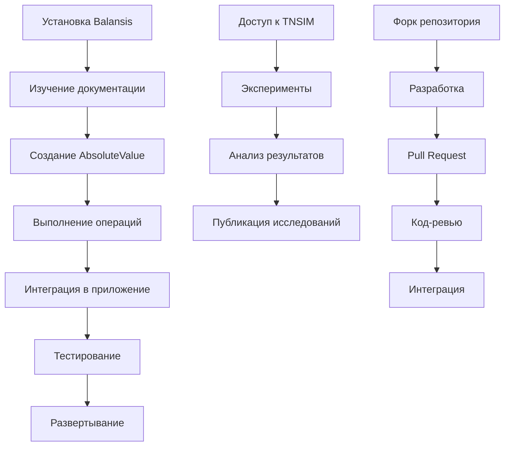

# Требования к продукту Balansis

## 1. Обзор продукта

Balansis - это инновационная Python математическая библиотека, реализующая Теорию Абсолютной Компенсации (ACT) для решения проблем численной нестабильности в вычислениях. Библиотека заменяет традиционные ноль и бесконечность на "Абсолют" и "Вечность", обеспечивая стабильные математические операции.

Продукт решает критические проблемы численной нестабильности в научных вычислениях, машинном обучении и математическом моделировании, предоставляя разработчикам и исследователям надежные инструменты для высокоточных вычислений.

Целевая аудитория включает исследователей в области машинного обучения, разработчиков научного ПО, математиков и инженеров, работающих с численными методами.

## 2. Основные функции

### 2.1 Роли пользователей

| Роль | Метод регистрации | Основные права |
|------|-------------------|----------------|
| Разработчик | Установка через pip/conda | Может использовать все функции библиотеки, создавать приложения |
| Исследователь | Установка + доступ к документации | Может проводить эксперименты, использовать расширенные функции |
| Контрибьютор | GitHub аккаунт + форк репозитория | Может вносить изменения в код, предлагать улучшения |

### 2.2 Модули функций

Наши требования к продукту Balansis состоят из следующих основных компонентов:

1. **Основная библиотека**: ядро ACT, классы AbsoluteValue и EternalRatio, компенсатор
2. **Модуль TNSIM**: теория нулевых сумм бесконечных множеств, высокоточные вычисления
3. **Документация**: API справочник, руководства пользователя, примеры использования
4. **Тестирование**: модульные тесты, интеграционные тесты, бенчмарки производительности
5. **Интеграция BalansisLLM**: нейронные сети с ACT, стабилизация градиентов

### 2.3 Детали страниц

| Компонент | Модуль | Описание функций |
|-----------|--------|------------------|
| Основная библиотека | AbsoluteValue | Создание стабильных значений с величиной и направлением. Компенсированные арифметические операции. Валидация входных данных |
| Основная библиотека | EternalRatio | Работа с бесконечными отношениями. Операции деления без потери точности. Стабилизация результатов |
| Основная библиотека | Compensator | Автоматическая компенсация ошибок округления. Стабилизация численных операций. Адаптивные алгоритмы |
| TNSIM | ZeroSumSets | Создание и управление множествами нулевой суммы. Операции с бесконечными множествами. Анализ сходимости |
| TNSIM | HighPrecision | Высокоточные вычисления с компенсацией ошибок. Параллельные вычисления. Кэширование результатов |
| Документация | API Reference | Автоматическая генерация документации из docstrings. Интерактивные примеры. Поиск по API |
| Документация | Tutorials | Пошаговые руководства для начинающих. Продвинутые техники. Практические примеры |
| Тестирование | Unit Tests | Покрытие всех классов и методов. Тестирование граничных случаев. Автоматический запуск |
| Тестирование | Benchmarks | Измерение производительности. Сравнение с традиционными методами. Профилирование памяти |
| BalansisLLM | ACT Transformer | Интеграция ACT в архитектуру трансформера. Стабилизация весов и градиентов. Оптимизированное внимание |

## 3. Основные процессы

### Поток разработчика
Разработчик устанавливает библиотеку через pip, изучает документацию, создает AbsoluteValue объекты, выполняет компенсированные операции, интегрирует в свое приложение, тестирует результаты и развертывает решение.

### Поток исследователя  
Исследователь получает доступ к библиотеке, изучает теоретические основы ACT, проводит эксперименты с TNSIM, анализирует результаты, публикует исследования и делится открытиями с сообществом.

### Поток контрибьютора
Контрибьютор форкает репозиторий, изучает архитектуру кода, вносит изменения или исправления, создает pull request, проходит код-ревью и интегрирует изменения в основную ветку.

## 4. Дизайн пользовательского интерфейса

### 4.1 Стиль дизайна

- **Основные цвета**: Синий (#2E86AB) для стабильности, зеленый (#A23B72) для компенсации
- **Вторичные цвета**: Серый (#F18F01) для нейтральных элементов, белый (#C73E1D) для фона
- **Стиль кнопок**: Закругленные углы с тенью, градиентная заливка
- **Шрифты**: Source Code Pro для кода (14px), Inter для текста (16px), заголовки (24px)
- **Стиль макета**: Карточный дизайн с четкой иерархией, боковая навигация
- **Иконки**: Математические символы (∞, ∑, ⊕), стрелки компенсации, графики стабильности

### 4.2 Обзор дизайна страниц

| Компонент | Модуль | UI элементы |
|-----------|--------|-------------|
| Документация | Главная страница | Логотип Balansis, навигационное меню, карточки основных функций, интерактивные примеры кода с подсветкой синтаксиса |
| Документация | API Reference | Древовидная навигация по классам, поиск в реальном времени, код-блоки с кнопками копирования, интерактивные диаграммы |
| Документация | Tutorials | Пошаговые инструкции с прогресс-баром, встроенные примеры кода, визуализация результатов, кнопки "Попробовать" |
| Тестирование | Test Dashboard | Графики покрытия кода, результаты тестов в реальном времени, бенчмарки производительности, цветовая индикация статуса |
| TNSIM | Interactive Demo | Визуализация бесконечных множеств, слайдеры для параметров, графики сходимости, анимации компенсации |
| BalansisLLM | Model Interface | Панель управления моделью, визуализация архитектуры, метрики стабильности, интерактивные графики обучения |

### 4.3 Адаптивность

Продукт ориентирован на desktop-first подход с адаптацией для планшетов. Основная аудитория работает на рабочих станциях для научных вычислений. Мобильная версия предоставляет доступ к документации и простым примерам. Оптимизация для сенсорного взаимодействия включает увеличенные кнопки и жесты прокрутки для графиков.

## 5. Технические требования

### 5.1 Производительность
- Операции с AbsoluteValue должны выполняться не медленнее чем в 2 раза по сравнению с float
- TNSIM должен обрабатывать множества до 10^6 элементов за разумное время
- Память: оптимизированное использование для больших наборов данных

### 5.2 Совместимость
- Python 3.8+ поддержка
- Совместимость с NumPy, SciPy, PyTorch
- Кроссплатформенность: Windows, macOS, Linux
- Интеграция с Jupyter Notebook

### 5.3 Качество кода
- Покрытие тестами не менее 90%
- Соответствие PEP 8 стандартам
- Типизация с mypy
- Документация для всех публичных API

## 6. Критерии приемки

### 6.1 Функциональные критерии
- Все основные классы (AbsoluteValue, EternalRatio, Compensator) работают корректно
- TNSIM выполняет операции с бесконечными множествами
- Документация полная и актуальная
- Тесты проходят на всех поддерживаемых платформах

### 6.2 Качественные критерии
- Численная стабильность превосходит традиционные методы
- Производительность приемлема для практического использования
- API интуитивно понятен для целевой аудитории
- Документация помогает быстро начать работу

### 6.3 Интеграционные критерии
- Успешная интеграция с популярными научными библиотеками
- BalansisLLM демонстрирует практическую применимость
- Примеры работают без ошибок
- Установка через pip проходит без проблем

---

*Документ описывает требования к математической библиотеке Balansis и связанным компонентам экосистемы*