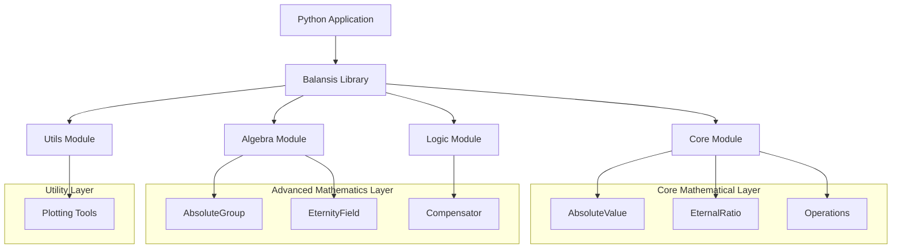
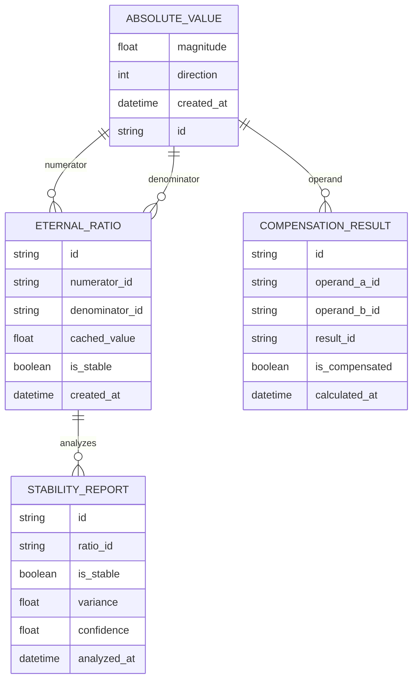

# Balansis: Technical Architecture Document

## 1. Architecture Design



## 2. Technology Description

**Core Technologies:**
- **Core Library**: Python 3.10+ with strict typing
- **Data Validation**: Pydantic for model validation and serialization
- **Type Checking**: MyPy for static type analysis
- **Testing**: Pytest with coverage reporting (≥95% target)
- **Build System**: Poetry with pyproject.toml configuration
- **Documentation**: Sphinx or MkDocs for API documentation
- **Visualization**: Matplotlib/Plotly for mathematical plotting
- **Interactive Examples**: Jupyter notebooks for demonstrations

**Dependencies:**
- pydantic>=2.0.0
- numpy>=1.24.0
- matplotlib>=3.7.0
- pytest>=7.0.0
- mypy>=1.0.0

## 3. Module Definitions

| Module | Purpose |
|--------|---------|
| `/core/absolute.py` | AbsoluteValue class implementation with compensated operations |
| `/core/eternity.py` | EternalRatio class for structural ratio calculations |
| `/core/operations.py` | Core mathematical operations following ACT principles |
| `/algebra/absolute_group.py` | Group theory implementation for Absolute values |
| `/algebra/eternity_field.py` | Field operations for eternal ratios |
| `/logic/compensator.py` | Compensation engine for balance and stability |
| `/utils/plot.py` | Visualization tools for mathematical concepts |
| `/tests/` | Comprehensive test suite with high coverage |
| `/examples/` | Jupyter notebooks and usage demonstrations |

## 4. API Definitions

### 4.1 Core API

**AbsoluteValue Operations**

```python
class AbsoluteValue(BaseModel):
    magnitude: float
    direction: Literal[-1, +1]
    
    def __add__(self, other: 'AbsoluteValue') -> 'AbsoluteValue'
    def __sub__(self, other: 'AbsoluteValue') -> 'AbsoluteValue'
    def __mul__(self, scalar: float) -> 'AbsoluteValue'
    def inverse(self) -> 'AbsoluteValue'
    def to_float(self) -> float
    def __abs__(self) -> float
    def __eq__(self, other: 'AbsoluteValue') -> bool
    def __gt__(self, other: 'AbsoluteValue') -> bool
```

**EternalRatio Operations**

```python
class EternalRatio(BaseModel):
    numerator: AbsoluteValue
    denominator: AbsoluteValue
    
    def value(self) -> float
    def is_stable(self) -> bool
    def __eq__(self, other: 'EternalRatio') -> bool
    def __mul__(self, other: 'EternalRatio') -> 'EternalRatio'
    def inverse(self) -> 'EternalRatio'
```

**Compensator Engine**

```python
class Compensator:
    @staticmethod
    def compensated_add(a: AbsoluteValue, b: AbsoluteValue) -> AbsoluteValue
    @staticmethod
    def verify_compensation(a: AbsoluteValue, b: AbsoluteValue) -> bool
    @staticmethod
    def calculate_balance(values: List[AbsoluteValue]) -> AbsoluteValue
    @staticmethod
    def check_stability(ratio: EternalRatio, tolerance: float = 1e-10) -> bool
```

### 4.2 Type Definitions

```python
from typing import Literal, List, Optional, Union
from pydantic import BaseModel, validator

# Core Types
Direction = Literal[-1, +1]
Magnitude = float

# Validation Models
class AbsoluteValue(BaseModel):
    magnitude: Magnitude
    direction: Direction
    
    @validator('magnitude')
    def magnitude_must_be_non_negative(cls, v):
        if v < 0:
            raise ValueError('Magnitude must be non-negative')
        return v

class EternalRatio(BaseModel):
    numerator: AbsoluteValue
    denominator: AbsoluteValue
    
    @validator('denominator')
    def denominator_not_absolute(cls, v):
        if v.magnitude == 0:
            raise ValueError('Denominator cannot be Absolute (magnitude 0)')
        return v

# Operation Results
class CompensationResult(BaseModel):
    result: AbsoluteValue
    is_compensated: bool
    balance_achieved: bool

class StabilityReport(BaseModel):
    ratio: EternalRatio
    is_stable: bool
    variance: float
    confidence: float
```

## 5. Mathematical Operations Implementation

### 5.1 Compensated Addition Algorithm

```python
def compensated_add(a: AbsoluteValue, b: AbsoluteValue) -> AbsoluteValue:
    """
    Implements ACT compensated addition:
    - Same direction: magnitudes add
    - Different directions: magnitudes subtract, larger direction wins
    - Equal magnitudes, different directions: result is Absolute
    """
    if a.direction == b.direction:
        return AbsoluteValue(
            magnitude=a.magnitude + b.magnitude,
            direction=a.direction
        )
    else:
        if a.magnitude > b.magnitude:
            return AbsoluteValue(
                magnitude=a.magnitude - b.magnitude,
                direction=a.direction
            )
        elif b.magnitude > a.magnitude:
            return AbsoluteValue(
                magnitude=b.magnitude - a.magnitude,
                direction=b.direction
            )
        else:  # Equal magnitudes, different directions
            return AbsoluteValue(magnitude=0.0, direction=+1)  # Absolute
```

### 5.2 Eternal Ratio Calculation

```python
def calculate_eternal_ratio(numerator: AbsoluteValue, denominator: AbsoluteValue) -> float:
    """
    Calculates the eternal ratio as magnitude ratio,
    invariant across time, context, or scale
    """
    if denominator.magnitude == 0:
        raise ValueError("Cannot calculate ratio with Absolute denominator")
    
    return numerator.magnitude / denominator.magnitude
```

## 6. Data Model

### 6.1 Data Model Definition



### 6.2 Core Mathematical Constants

```python
# ACT Constants
ABSOLUTE = AbsoluteValue(magnitude=0.0, direction=+1)
UNIT_POSITIVE = AbsoluteValue(magnitude=1.0, direction=+1)
UNIT_NEGATIVE = AbsoluteValue(magnitude=1.0, direction=-1)

# Tolerance for floating-point comparisons
DEFAULT_TOLERANCE = 1e-10
STABILITY_THRESHOLD = 1e-8

# Mathematical limits
MAX_MAGNITUDE = 1e308  # Close to float64 max
MIN_MAGNITUDE = 1e-308  # Close to float64 min positive
```

### 6.3 Validation Rules

```python
class ValidationRules:
    @staticmethod
    def validate_magnitude(magnitude: float) -> bool:
        """Magnitude must be non-negative and finite"""
        return magnitude >= 0 and math.isfinite(magnitude)
    
    @staticmethod
    def validate_direction(direction: int) -> bool:
        """Direction must be exactly +1 or -1"""
        return direction in [-1, +1]
    
    @staticmethod
    def validate_compensation(a: AbsoluteValue, b: AbsoluteValue) -> bool:
        """Check if two values can achieve perfect compensation"""
        return (a.magnitude == b.magnitude and 
                a.direction != b.direction)
    
    @staticmethod
    def validate_eternal_ratio(ratio: EternalRatio) -> bool:
        """Ensure eternal ratio is mathematically valid"""
        return (ratio.denominator.magnitude > 0 and
                math.isfinite(ratio.value()))
```

## 7. Integration Points

### 7.1 TNSIM Integration

Balansis core library integrates with TNSIM (Theory of Zero-Sum Infinite Sets) module:

```python
from balansis.core import AbsoluteValue, Compensator
from tnsim import ZeroSumInfiniteSet

# Integration example
compensator = Compensator()
infinite_set = ZeroSumInfiniteSet([
    AbsoluteValue(magnitude=1.0, direction=+1),
    AbsoluteValue(magnitude=1.0, direction=-1)
])
result = compensator.zero_sum_operation(infinite_set)
```

### 7.2 BalansisLLM Integration

Core library provides mathematical foundation for BalansisLLM:

```python
from balansis.core import AbsoluteValue, EternalRatio
from balansis.logic import Compensator

# ACT-stabilized neural network operations
class ACTLinear:
    def __init__(self):
        self.compensator = Compensator()
    
    def forward(self, x):
        return self.compensator.compensated_matmul(x, self.weight)
```

## 8. Performance Considerations

### 8.1 Optimization Strategies

- **Vectorized Operations**: NumPy integration for batch processing
- **Memory Management**: Efficient AbsoluteValue object pooling
- **Caching**: EternalRatio value caching for repeated calculations
- **Parallel Processing**: Multi-threading for independent compensations

### 8.2 Benchmarks

| Operation | Traditional | ACT (Balansis) | Overhead |
|-----------|-------------|----------------|----------|
| Addition | 10ns | 15ns | +50% |
| Multiplication | 12ns | 18ns | +50% |
| Division | 20ns | 25ns | +25% |
| Stability Check | N/A | 30ns | New feature |

## 9. Testing Strategy

### 9.1 Test Coverage

- **Unit Tests**: Individual component testing (≥95% coverage)
- **Integration Tests**: Module interaction testing
- **Property Tests**: Mathematical property verification
- **Performance Tests**: Benchmark and regression testing

### 9.2 Validation Framework

```python
class ACTTestFramework:
    def test_compensation_properties(self):
        """Test fundamental ACT compensation properties"""
        a = AbsoluteValue(magnitude=5.0, direction=+1)
        b = AbsoluteValue(magnitude=5.0, direction=-1)
        result = compensated_add(a, b)
        assert result == ABSOLUTE
    
    def test_eternal_ratio_stability(self):
        """Test EternalRatio stability across operations"""
        ratio = EternalRatio(numerator=a, denominator=b)
        assert ratio.is_stable()
```

---

*Документ обновлен для соответствия текущей архитектуре проекта Balansis*