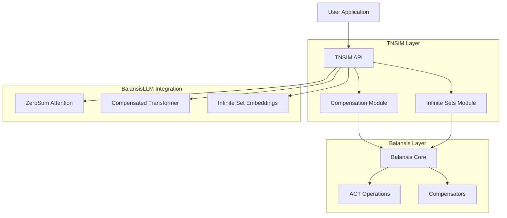
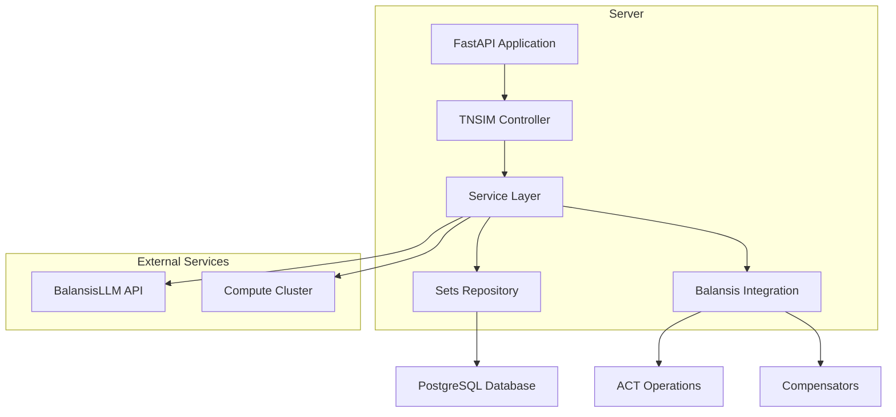
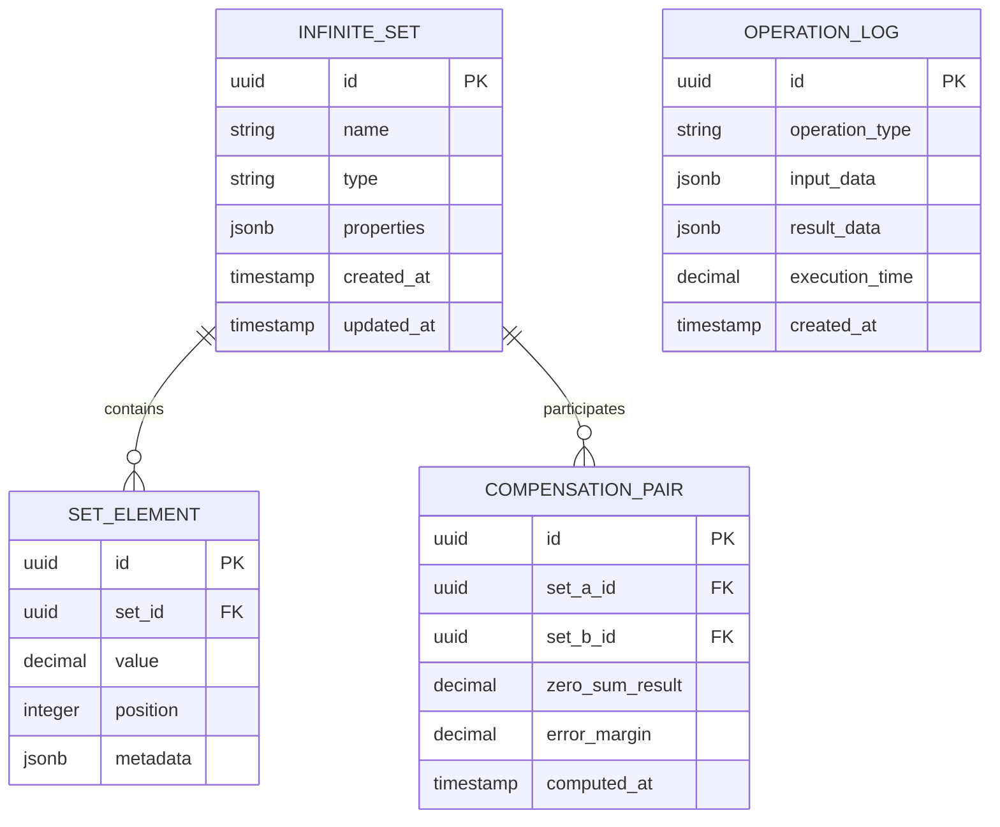

# TNSIM Technical Architecture

## 1. Architectural Design



## 2. Technology Stack

- Frontend: Python API + Jupyter Notebooks for research
- Backend: Python@3.9+ with Balansis integration
- Mathematical libraries: NumPy, SciPy, SymPy
- ML integration: PyTorch for BalansisLLM
- Visualization: Matplotlib, Plotly

## 3. API Route Definitions

| Route | Purpose |
|-------|----------|
| /api/zerosum/create | Create new infinite set |
| /api/zerosum/compensate | Find compensating set |
| /api/zerosum/operation | Execute ⊕ operation |
| /api/zerosum/validate | Validate zero sum |
| /api/integration/balansis | Balansis integration |
| /api/integration/llm | BalansisLLM integration |

## 4. API Definitions

### 4.1 Core APIs

Create infinite set
```
POST /api/zerosum/create
```

Request:
| Parameter | Type | Required | Description |
|-----------|------|----------|-------------|
| elements | array | true | Set elements |
| type | string | true | Set type (harmonic, alternating, custom) |
| properties | object | false | Additional properties |

Response:
| Parameter | Type | Description |
|-----------|------|-------------|
| set_id | string | Set identifier |
| status | boolean | Creation status |
| compensating_set | object | Compensating set |

Example:
```json
{
  "elements": [1, 0.5, 0.33, 0.25],
  "type": "harmonic",
  "properties": {
    "convergence_type": "divergent",
    "compensation_method": "direct"
  }
}
```

Execute ⊕ operation
```
POST /api/zerosum/operation
```

Request:
| Parameter | Type | Required | Description |
|-----------|------|----------|-------------|
| set_a_id | string | true | First set ID |
| set_b_id | string | true | Second set ID |
| operation_type | string | true | Operation type (direct, compensated) |

Response:
| Parameter | Type | Description |
|-----------|------|-------------|
| result | number | Operation result |
| is_zero_sum | boolean | Whether result is zero sum |
| error_margin | number | Calculation error margin |

## 5. Server Architecture



## 6. Data Model

### 6.1 Data Model Definition



### 6.2 DDL Definitions

Infinite sets table (infinite_sets)
```sql
-- create table
CREATE TABLE infinite_sets (
    id UUID PRIMARY KEY DEFAULT gen_random_uuid(),
    name VARCHAR(255) NOT NULL,
    type VARCHAR(50) NOT NULL CHECK (type IN ('harmonic', 'alternating', 'geometric', 'custom')),
    properties JSONB DEFAULT '{}',
    element_count BIGINT DEFAULT 0,
    is_compensated BOOLEAN DEFAULT FALSE,
    created_at TIMESTAMP WITH TIME ZONE DEFAULT NOW(),
    updated_at TIMESTAMP WITH TIME ZONE DEFAULT NOW()
);

-- create indexes
CREATE INDEX idx_infinite_sets_type ON infinite_sets(type);
CREATE INDEX idx_infinite_sets_created_at ON infinite_sets(created_at DESC);
CREATE INDEX idx_infinite_sets_compensated ON infinite_sets(is_compensated);

-- set elements table
CREATE TABLE set_elements (
    id UUID PRIMARY KEY DEFAULT gen_random_uuid(),
    set_id UUID NOT NULL REFERENCES infinite_sets(id) ON DELETE CASCADE,
    value DECIMAL(20,10) NOT NULL,
    position BIGINT NOT NULL,
    metadata JSONB DEFAULT '{}',
    created_at TIMESTAMP WITH TIME ZONE DEFAULT NOW()
);

CREATE INDEX idx_set_elements_set_id ON set_elements(set_id);
CREATE INDEX idx_set_elements_position ON set_elements(set_id, position);

-- compensation pairs table
CREATE TABLE compensation_pairs (
    id UUID PRIMARY KEY DEFAULT gen_random_uuid(),
    set_a_id UUID NOT NULL REFERENCES infinite_sets(id),
    set_b_id UUID NOT NULL REFERENCES infinite_sets(id),
    zero_sum_result DECIMAL(20,10) NOT NULL,
    error_margin DECIMAL(20,10) DEFAULT 0.0,
    computation_method VARCHAR(50) DEFAULT 'direct',
    computed_at TIMESTAMP WITH TIME ZONE DEFAULT NOW()
);

CREATE INDEX idx_compensation_pairs_sets ON compensation_pairs(set_a_id, set_b_id);
CREATE INDEX idx_compensation_pairs_result ON compensation_pairs(zero_sum_result);

-- operation logs table
CREATE TABLE operation_logs (
    id UUID PRIMARY KEY DEFAULT gen_random_uuid(),
    operation_type VARCHAR(50) NOT NULL,
    input_data JSONB NOT NULL,
    result_data JSONB NOT NULL,
    execution_time DECIMAL(10,6) NOT NULL,
    success BOOLEAN DEFAULT TRUE,
    error_message TEXT,
    created_at TIMESTAMP WITH TIME ZONE DEFAULT NOW()
);

CREATE INDEX idx_operation_logs_type ON operation_logs(operation_type);
CREATE INDEX idx_operation_logs_created_at ON operation_logs(created_at DESC);

-- initial data
INSERT INTO infinite_sets (name, type, properties) VALUES 
('Harmonic Series', 'harmonic', '{"formula": "1/n", "divergent": true}'),
('Compensating Harmonic', 'harmonic', '{"formula": "-1/n", "compensates": true}'),
('Alternating Series', 'alternating', '{"formula": "(-1)^n/n", "convergent": true}');
```

## 7. Core Implementation Components

### 7.1 ZeroSumInfiniteSet Class

```python
from balansis.core.operations import compensated_sum
from balansis.logic.compensator import Compensator
import numpy as np
from typing import List, Optional, Union

class ZeroSumInfiniteSet:
    def __init__(self, elements: List[float], set_type: str = 'custom'):
        self.elements = np.array(elements)
        self.set_type = set_type
        self.compensator = Compensator()
        self._compensating_set = None
    
    def zero_sum_operation(self, other: 'ZeroSumInfiniteSet') -> float:
        """Execute ⊕ operation"""
        return self.compensator.compensate(
            self.elements.sum(),
            other.elements.sum()
        )
    
    def find_compensating_set(self) -> 'ZeroSumInfiniteSet':
        """Find compensating set"""
        if self._compensating_set is None:
            compensating_elements = -self.elements
            self._compensating_set = ZeroSumInfiniteSet(
                compensating_elements.tolist(),
                f"compensating_{self.set_type}"
            )
        return self._compensating_set
    
    def validate_zero_sum(self, tolerance: float = 1e-10) -> bool:
        """Validate zero sum"""
        compensating = self.find_compensating_set()
        result = self.zero_sum_operation(compensating)
        return abs(result) < tolerance
```

### 7.2 BalansisLLM Integration

```python
import torch
import torch.nn as nn
from balansis.core.operations import compensated_matmul

class ZeroSumAttention(nn.Module):
    """Attention mechanism with TNSIM principles"""
    
    def __init__(self, d_model: int, n_heads: int):
        super().__init__()
        self.d_model = d_model
        self.n_heads = n_heads
        self.d_k = d_model // n_heads
        
        self.w_q = nn.Linear(d_model, d_model)
        self.w_k = nn.Linear(d_model, d_model)
        self.w_v = nn.Linear(d_model, d_model)
        self.w_o = nn.Linear(d_model, d_model)
        
        self.compensator = Compensator()
    
    def forward(self, query, key, value, mask=None):
        batch_size = query.size(0)
        
        # Apply compensation principles
        Q = self.compensator.stabilize(self.w_q(query))
        K = self.compensator.stabilize(self.w_k(key))
        V = self.compensator.stabilize(self.w_v(value))
        
        # Reshape for multi-head attention
        Q = Q.view(batch_size, -1, self.n_heads, self.d_k).transpose(1, 2)
        K = K.view(batch_size, -1, self.n_heads, self.d_k).transpose(1, 2)
        V = V.view(batch_size, -1, self.n_heads, self.d_k).transpose(1, 2)
        
        # Compensated attention scores computation
        scores = compensated_matmul(Q, K.transpose(-2, -1)) / np.sqrt(self.d_k)
        
        if mask is not None:
            scores = scores.masked_fill(mask == 0, -1e9)
        
        # Stabilized softmax
        attention_weights = self.compensator.stable_softmax(scores)
        
        # Apply weights to values
        context = compensated_matmul(attention_weights, V)
        
        # Combine heads
        context = context.transpose(1, 2).contiguous().view(
            batch_size, -1, self.d_model
        )
        
        return self.w_o(context)
```

## 8. Deployment and Monitoring

### 8.1 Docker Configuration

```dockerfile
FROM python:3.9-slim

WORKDIR /app

COPY requirements.txt .
RUN pip install -r requirements.txt

COPY . .

EXPOSE 8000

CMD ["uvicorn", "main:app", "--host", "0.0.0.0", "--port", "8000"]
```

### 8.2 Kubernetes Deployment

```yaml
apiVersion: apps/v1
kind: Deployment
metadata:
  name: tnsim-api
spec:
  replicas: 3
  selector:
    matchLabels:
      app: tnsim-api
  template:
    metadata:
      labels:
        app: tnsim-api
    spec:
      containers:
      - name: tnsim-api
        image: tnsim:latest
        ports:
        - containerPort: 8000
        env:
        - name: DATABASE_URL
          valueFrom:
            secretKeyRef:
              name: tnsim-secrets
              key: database-url
```

## 9. Testing and Validation

### 9.1 Unit Tests

```python
import pytest
from tnsim.core import ZeroSumInfiniteSet

class TestZeroSumInfiniteSet:
    def test_harmonic_series_compensation(self):
        # Test harmonic series compensation
        harmonic = ZeroSumInfiniteSet([1/i for i in range(1, 101)], 'harmonic')
        compensating = harmonic.find_compensating_set()
        
        result = harmonic.zero_sum_operation(compensating)
        assert abs(result) < 1e-10
    
    def test_alternating_series(self):
        # Test alternating series
        alternating = ZeroSumInfiniteSet(
            [(-1)**i / i for i in range(1, 101)], 
            'alternating'
        )
        
        assert alternating.validate_zero_sum(tolerance=1e-8)
```

### 9.2 Integration Tests

```python
import pytest
from fastapi.testclient import TestClient
from main import app

client = TestClient(app)

def test_create_infinite_set():
    response = client.post("/api/zerosum/create", json={
        "elements": [1, 0.5, 0.33, 0.25],
        "type": "harmonic"
    })
    assert response.status_code == 200
    assert "set_id" in response.json()

def test_zero_sum_operation():
    # Create two sets
    set_a = client.post("/api/zerosum/create", json={
        "elements": [1, 2, 3],
        "type": "custom"
    }).json()
    
    set_b = client.post("/api/zerosum/create", json={
        "elements": [-1, -2, -3],
        "type": "custom"
    }).json()
    
    # Execute operation
    response = client.post("/api/zerosum/operation", json={
        "set_a_id": set_a["set_id"],
        "set_b_id": set_b["set_id"],
        "operation_type": "direct"
    })
    
    assert response.status_code == 200
    result = response.json()
    assert result["is_zero_sum"] == True
    assert abs(result["result"]) < 1e-10

def test_create_infinite_set_api():
    # Test creating infinite set via API
    response = client.post('/api/v1/infinite-sets/', json={
        'elements': [1, 2, 3, 4, 5],
        'set_type': 'arithmetic',
        'metadata': {'description': 'Test arithmetic set'}
    })
    
    assert response.status_code == 201
    data = response.json()
    assert data['set_type'] == 'arithmetic'
    assert len(data['elements']) == 5

def test_zero_sum_operation_api():
    # Test zero sum operation via API
    # Create set
    create_response = client.post('/api/v1/infinite-sets/', json={
        'elements': [1, -1, 2, -2, 3, -3],
        'set_type': 'alternating'
    })
    set_id = create_response.json()['id']
    
    # Execute operation
    operation_response = client.post(
        f'/api/v1/infinite-sets/{set_id}/operations/',
        json={'operation_type': 'zero_sum'}
    )
    
    assert operation_response.status_code == 200
    result = operation_response.json()
    assert abs(result['result']) < 1e-10
```

## 10. Performance and Optimization

### 10.1 Result Caching

```python
from functools import lru_cache
import redis

class TNSIMCache:
    def __init__(self):
        self.redis_client = redis.Redis(host='localhost', port=6379, db=0)
    
    @lru_cache(maxsize=1000)
    def get_compensating_set(self, set_hash: str):
        """Cache compensating sets"""
        cached = self.redis_client.get(f"compensating:{set_hash}")
        if cached:
            return json.loads(cached)
        return None
    
    def cache_result(self, key: str, result: dict, ttl: int = 3600):
        """Cache computation results"""
        self.redis_client.setex(
            key, 
            ttl, 
            json.dumps(result, default=str)
        )
```

### 10.2 Parallel Computing

```python
import asyncio
import concurrent.futures
from typing import List

class ParallelTNSIM:
    def __init__(self, max_workers: int = 4):
        self.executor = concurrent.futures.ThreadPoolExecutor(
            max_workers=max_workers
        )
    
    async def parallel_compensation(self, sets: List[ZeroSumInfiniteSet]):
        """Parallel compensation computation"""
        loop = asyncio.get_event_loop()
        
        tasks = [
            loop.run_in_executor(
                self.executor,
                set_obj.find_compensating_set
            )
            for set_obj in sets
        ]
        
        return await asyncio.gather(*tasks)
```

This technical architecture provides a complete implementation of TNSIM with integration into the Balansis and BalansisLLM ecosystem, delivering a scalable and performant solution for working with infinite sets and their compensation.